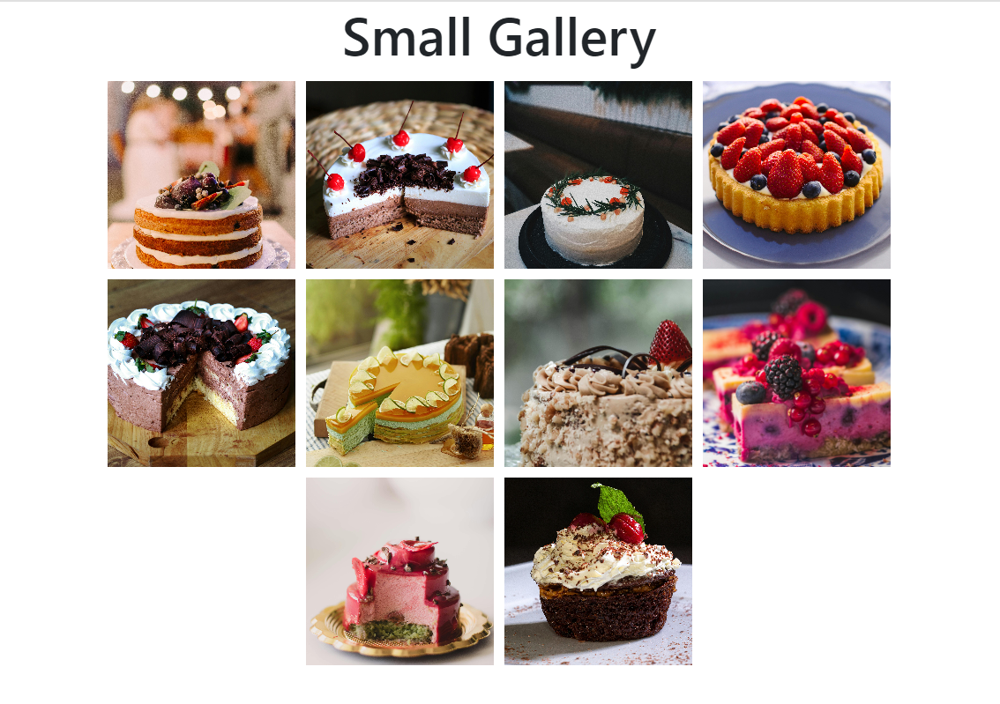
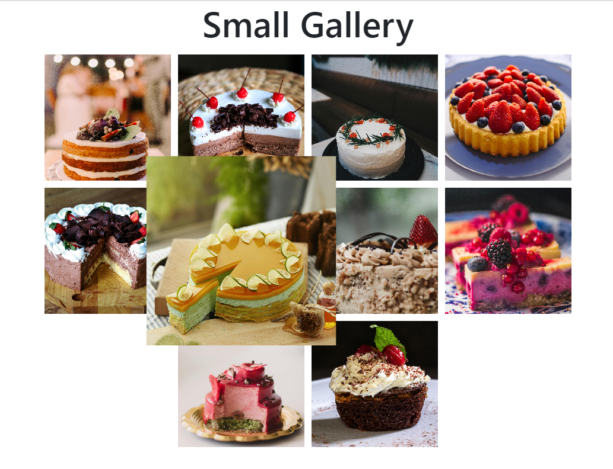
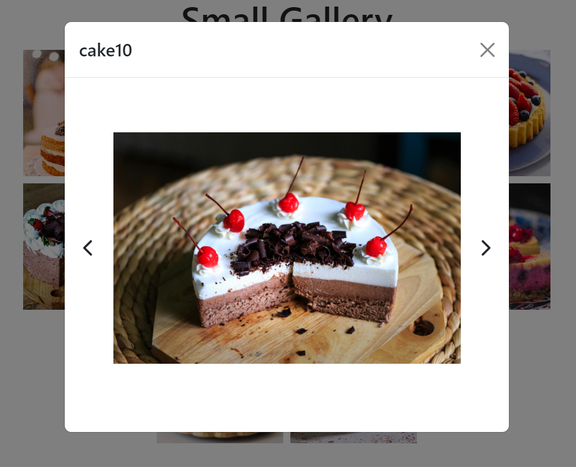

# Small Gallery

## Overview

A small gallery with modal image viewer where you can go next and previous pictures with left and right arrow.
The result screenshots can be found in the "result-photos" folder.

## Languages

HTML, JAVASCRIPT and BOOTSTRAP CSS Framework with expressjs

## Screenshots

## Instruction before running

The pictures shown in the gallery are all saved in the "images" folder. The pictures files are fetched from that folder with an api written in server.mjs.

Since there is a server-side function, the file cannot be run directly from browser.
It needs to be run through server (e.g. http, node, etc)
To run on server, server.mjs file needs to be run in command prompt from its directory with the command like "node server.mjs".
After that, the contents can be found on localhost:3000.
